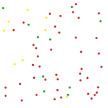

# baltimore_covid_vaccine_tracker

A simple weekend hack project to visualize current levels of vaccination in Baltimore MD.



The program begins by scraping the [baltimore arcgis page](https://coronavirusvaccineoutreach-bc-gis.hub.arcgis.com/#statistics) for vaccine percentages.  It then starts a 2d particle collision simulator.  Red particles represent people who are unvaccinated, yellow have only the first shot, green are fully vaccinated.  

### Usage

```
Get code
$ git clone git@github.com:Chaflan/baltimore_covid_vaccine_tracker.git
$ cd baltimore_covid_vaccine_tracker

Set up virtual environment
$ python -m venv venv-baltimore_covid_vaccine_tracker
$ source venv-baltimore_covid_vaccine_tracker/bin/activate
$ python -m pip install -r requirements.txt

Run
$ python baltimore_covid_vaccine_tracker.py

Deactivate venv when done
$ deactivate
```

### Credits

The particle simulator is a lightly modified version of the project [xnx/collision](
https://github.com/xnx/collision)
